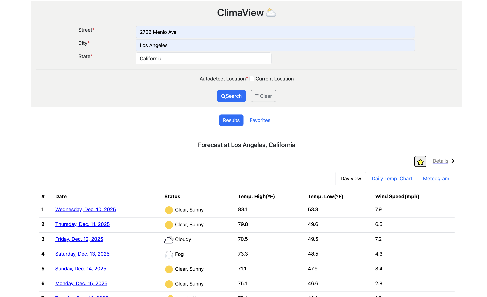
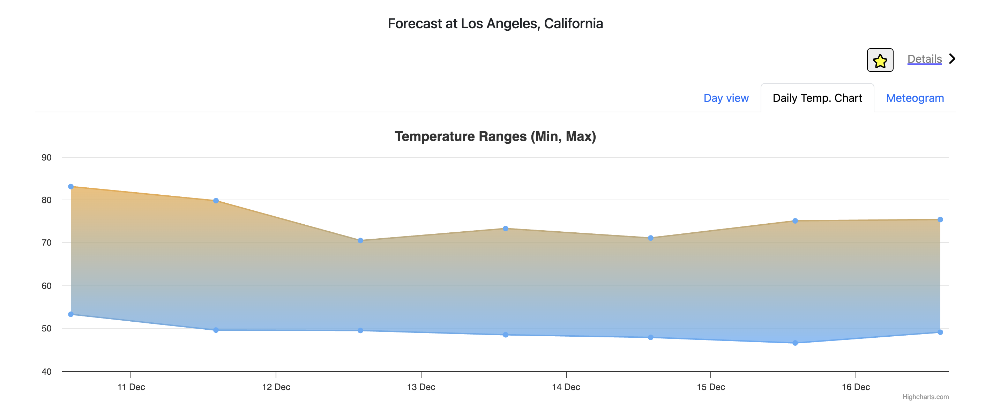
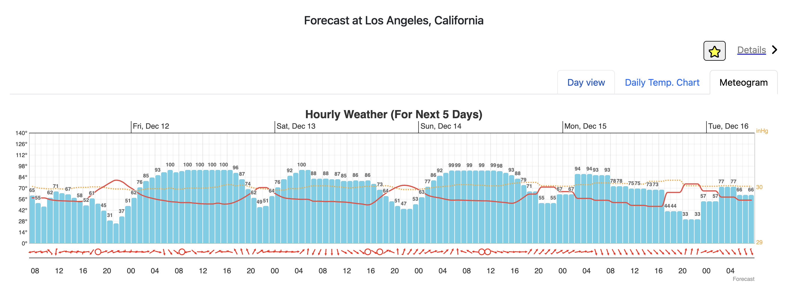
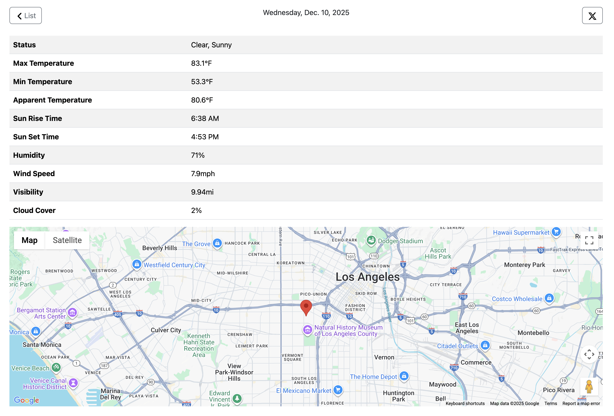

# ClimaView

A robust, full-stack weather application built with the MERN stack (MongoDB, Express, React, Node.js). ClimaView provides real-time weather updates, detailed forecasts, and interactive charts for cities worldwide, featuring a seamless search experience and favorites management.

## 🚀 Features & Capabilities

- **Real-Time Weather Data**: Get up-to-date temperature, wind speed, humidity, pressure, and more.
- **Location Search**: Autocomplete search functionality powered by Google Places API.
- **Interactive Visualizations**: Highcharts integration for Meteograms and temperature trends.
- **Detailed Forecasts**: Daily and hourly weather breakdowns.
- **Favorites System**: Save and manage your favorite cities for quick access.
- **Responsive Design**: Built with Bootstrap for a consistent experience across devices.
- **View Switching**: Easily toggle between current Search Results and Favorites list.

## 🛠 Tech Stack

### Frontend
- **Framework**: [React](https://reactjs.org/) (Vite)
- **State Management**: [Redux](https://redux.js.org/) (with Thunk)
- **Styling**: [Bootstrap 5](https://getbootstrap.com/), SCSS
- **Charts**: [Highcharts](https://www.highcharts.com/)
- **Maps**: @vis.gl/react-google-maps
- **HTTP Client**: Axios

### Backend
- **Server**: [Node.js](https://nodejs.org/), [Express](https://expressjs.com/)
- **Database**: [MongoDB](https://www.mongodb.com/) (Forecasts & Favorites storage)
- **ODM**: [Mongoose](https://mongoosejs.com/)
- **API Integration**: Tomorrow.io API (Weather), Google Places API (Autocomplete)

### Tools & Deployment
- **Deployment**: [Vercel](https://vercel.com/)
- **Language**: JavaScript / TypeScript

## 📂 Project Architecture

The project is structured as a monolithic repository containing both the backend server and the frontend React application.

```
ClimaView/
├── app.js                  # Main Express server entry point
├── react_weather_search_app/ # Frontend React application
│   ├── src/
│   │   ├── components/     # UI Components (Details, Search, Charts, etc.)
│   │   ├── redux/          # Redux store, actions, and reducers
│   │   ├── assets/         # Weather icons and static assets
│   │   └── ...
│   ├── package.json        # Frontend dependencies
│   └── ...
├── package.json            # Backend dependencies and build scripts
└── vercel.json             # Vercel deployment configuration
```

## 🔌 API Endpoints

### Weather & Search
- `GET /dailyWeather`: Fetches weather data from Tomorrow.io.
  - Query Params: `lat`, `long` (and other Tomorrow.io params)
- `GET /autocomplete`: Proxy for Google Places Autocomplete.
  - Query Params: `input`

### Favorites (Internal API)
- `GET /favorites`: Retrieve list of saved favorite cities.
- `POST /favorites`: Add a new city to favorites.
- `DELETE /favorites/:id`: Remove a favorite by MongoDB ID.
- `DELETE /fav`: Remove a favorite by City name.

## ⚙️ Installation & Setup

### Prerequisites
- Node.js (v16+)
- MongoDB (Local or Atlas)
- API Keys for Tomorrow.io and Google Cloud (Places API)

### Steps

1. **Clone the repository**
   ```bash
   git clone https://github.com/yourusername/ClimaView.git
   cd ClimaView
   ```

2. **Install Backend Dependencies**
   ```bash
   npm install
   ```

3. **Install Frontend Dependencies**
   ```bash
   cd react_weather_search_app
   npm install
   cd ..
   ```

4. **Environment Variables**
   Create a `.env` file in the root directory and add the following:
   ```env
   PORT=8080
   MONGO_URI=your_mongodb_connection_string
   TOMORROW_API_KEY=your_tomorrow_io_api_key
   GOOGLE_PLACES_API_KEY=your_google_places_api_key
   ```

5. **Build the Frontend**
   ```bash
   npm run build
   ```
   *This script runs `yarn install && yarn run build` inside the frontend directory.*

6. **Run the Application**
   ```bash
   npm start
   ```
   The server will start on `http://localhost:8080` (or your defined PORT).

## 🖥 How to Run Locally (Dev Mode)

To run the frontend and backend separately for development:

1. **Start Backend**: `node app.js` (Root)
2. **Start Frontend**: `cd react_weather_search_app && npm run dev`

## 📸 Screenshots

*(Placeholder: Insert screenshots of the Dashboard, Search Interface, and Details View here)*





## ☁️ Deployment

The project is configured for deployment on **Vercel**.
The `vercel.json` file handles routing all requests to the Express backend (`app.js`), which serves the API and the static React files.

## 🔮 Future Improvements

- [ ] Add user authentication (Auth0 or Passport.js).
- [ ] Implement dark/light mode toggle.
- [ ] Add more weather data providers for comparison.
- [ ] Improve mobile responsiveness for charts.

## 📄 License

This project is licensed under the MIT License.

## 🙏 Acknowledgments

- **Tomorrow.io** for the comprehensive weather API.
- **Google Maps Platform** for location services.
- **Highcharts** for the excellent charting library.
